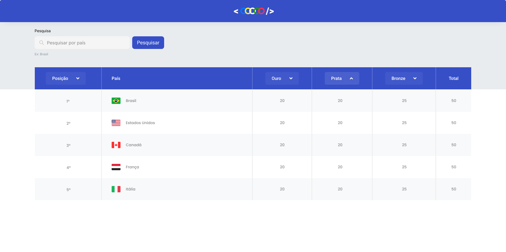

# Quadro de Medalhas

<figure>
    
</figure>

  - filtro por nome de país através de um campo de busca;
  - Por padrão, a ordenação será feita pela posição do país no ranking. — A posição será calculada a partir do total de medalhas, caso haja empate entre os países, o desempate será feito pela quantidade de medalhas de ouro;
  - Ordenação pela quantidade de medalhas de ouro;
  - Ordenação pela quantidade de medalhas de prata;
  - Ordenação pela quantidade de medalhas de bronze;
  - Voltar a ordenação padrão, ou seja, pela posição no ranking.
